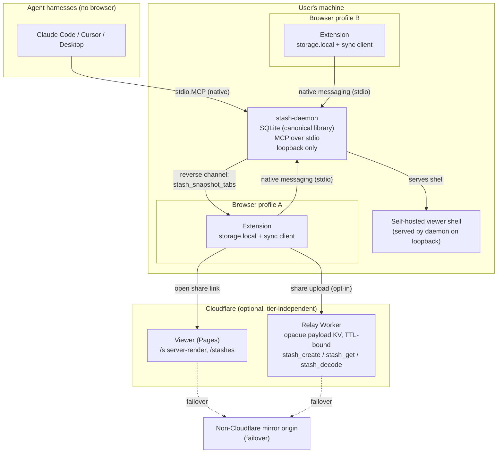

# Local-first re-platform: architecture spec

Issue: #44 ([architecture] Local-first re-platform: MCP daemon as source of
truth, extension sync, relay rework). Project: stash, Quarter 2, effort L,
classification `infra`. Start 2026-08-29, target 2026-09-05.

Status: spec draft for review. The deliverable of #44 is this document plus the
follow-up issue list in section 12, not any implementation. Two de-risking
spikes were run alongside it; their evidence is folded into sections 4, 6 and
the appendix.

Every file path and symbol below was verified by direct read on 2026-08-29
against `develop` at commit 6408793. Third-party library claims are either
linked to upstream or marked UNVERIFIED. Line numbers are given where they were
checked and are expected to drift.

---

## 1. Problem, success criteria, non-goals

### 1.1 The shape problem

"Source of truth" for a stash is split across three stores that never
reconcile:

1. **`browser.storage.local` in the extension.** `stashesItem =
   new StorageItem<StashRecord[]>("stash-records", { area: "local" })`
   (`apps/extension/lib/stash-store.ts:31-34`). This is the real local-first
   library. `StashRecord` (`stash-store.ts:8-16`):

   ```ts
   interface StashRecord {
     id: string;        // Date.now().toString(36)
     title?: string;
     tags: string[];
     note?: string;
     items: StashItem[]; // { url: string; title: string }
     createdAt: number;
     updatedAt: number;
   }
   ```

2. **Viewer `localStorage`.** A separate implementation,
   `apps/viewer/src/lib/stash-store.ts`, persists to `localStorage` under key
   `"stash:records"` (`:22`, `:38-40`) with `crypto.randomUUID()` ids (`:70`).
   Reached through `apps/viewer/src/hooks/useStashLibrary.ts` and rendered by
   `apps/viewer/src/components/MyStashes.tsx`. `MyStashes` is source-aware: on
   mount it probes the extension content-script bridge, and if the extension
   answers it renders those records in memory and never touches viewer
   `localStorage` (`MyStashes.tsx:334-360`, `:377`). Viewer `localStorage` is
   the fallback path for a browser with no extension installed.

3. **Shortener KV.** `packages/server-core/src/store.ts:42-60` `createStash()`
   writes `storage.setItem(id, JSON.stringify({ p, c, e, t? }), { ttl })` with
   a 6-char base32 id. Bound in `apps/shortener/src/index.ts:46-64` to
   `cloudflareKVBindingDriver({ binding: env.STASH_KV, base: "stash:" })`,
   `maxTtl: "7d"`. This holds only stashes explicitly uploaded for a short
   link; it has zero visibility into stores 1 and 2.

There is no sync between any pair of these, and nothing outside a browser can
read store 1 or 2 at all. The extension ships a real local MCP server
(`apps/extension/lib/mcp/server.ts`, 8 tools) but it is only reachable over a
Chrome runtime port named `mcp` (`apps/extension/entrypoints/background.ts:21-36`),
so only in-browser agents can call it. An agent harness with no browser open
(Claude Code and similar) has no path to the library. `apps/extension/AGENTS.md`
still describes a stdio relay for desktop MCP clients, and
`packages/mcp-relay/src/extensionTransport.ts` implements the relay side, but
the extension-side listener was never built (the file self-labels "Placeholder
transport").

### 1.2 What a daemon fixes, stated precisely

A long-lived local daemon that owns the canonical library and speaks MCP over
stdio gives every agent harness a direct, browser-free tool surface, and gives
the three stores a single thing to sync against. It also enables local,
network-free decode of pasted `/s/#p=...` links (see section 9a), which matters
because the payload is self-contained in the URL fragment and Cloudflare is
periodically unreachable for a whole country (see 1.3).

What a daemon does **not** fix: fetching *someone else's* short link, or
reaching `stash.illo.fyi` when the network route to Cloudflare is dead. Those
are addressed separately in sections 9 and 9a.

### 1.3 Availability constraint (context, not a success criterion)

`.agents/notes/2026-08-29-cloudflare-null-routed-in-spain-laliga.md`: Spanish
ISPs null-route Cloudflare IP ranges during football match windows under
LaLiga's court-ordered anti-piracy blocks. stash is hosted entirely on
Cloudflare (Pages for the viewer, Workers for the shortener), so during the
season a large share of Spanish users, including the maintainer, periodically
cannot reach any stash surface. The origin is up the whole time; the route is
gone. This is a recurring scheduled outage for an entire country and gets its
own mitigation section (9a) and follow-up issues.

### 1.4 Success criteria (falsifiable)

1. An agent harness with **no browser process running** can `stash_list` and
   `stash_create` against the daemon and see the result reflected in the
   extension popup after the next sync.
2. With **no daemon installed**, the extension behaves exactly as it does today:
   same storage, same popup, same MCP-over-port, same share flow. No feature
   regression, no new error surface, no new permission prompt.
3. **No existing user loses data.** Every `StashRecord` currently in
   `browser.storage.local`, every `HistoryEntry` in `stash-history`, and every
   file previously produced by `exportStashesToJSON` remains readable after
   migration.
4. The daemon performs **no always-on network egress**. A packet capture over a
   day of normal use shows loopback traffic only, unless the user explicitly
   uploads a stash to a relay.
5. A paired browser that loses the daemon connection keeps working in a defined
   degraded mode (section 2.4), and the extension shows a specific, actionable
   error, not a silent drop.
6. Go and TypeScript decode of every v6 fixture in
   `packages/e2e/fixtures/payloads.json` yield the same items and metadata
   (met by spike B, appendix B).

### 1.5 Non-goals

Restating and extending #44's out-of-scope list so section 10 has a boundary:

- Actual daemon implementation, CRDT sync implementation, and user/data
  migration execution (all #44 non-goals; the *strategy* for migration is in
  section 11).
- **Cross-machine sync.** Explicitly out of scope; recommended as a later,
  relay-mediated follow-up (section 5.4).
- **Mobile.** No daemon on mobile; the web `/s/new` flow stays the mobile path.
- **Account system / server-side identity.** The daemon is single-user,
  single-machine, loopback-trust (section 5).
- **Rewriting the viewer off Cloudflare Pages.** Section 9a recommends a mirror
  origin and local decode, not a migration.
- **Changing the encrypted payload format.** v6 stays; the only payload-shape
  question is the default transport (fragment vs query, section 9b) and whether
  the `e` field default moves (section 8).
- **Real-time collaboration / multiplayer editing.** The CRDT is for
  convergence across a user's own browsers, not concurrent editing sessions.

---

## 2. Deployment tiers and target architecture

### 2.1 Three tiers

Store users cannot be required to run `brew install`, so tier 1 is the majority
path and "daemon as source of truth" is true only for opt-ins. Every later
section marks which tier it designs for.

- **Tier 1: no daemon.** Extension standalone, `browser.storage.local`
  authoritative, viewer `localStorage` authoritative for the no-extension web
  user. This is today's product and must keep working byte-for-byte. Sections
  9, 9a (local decode excepted), 9b, and the DOM agent contract in section 10
  all apply here.
- **Tier 2: daemon + one browser.** Daemon authoritative. The extension runs a
  sync client that reconciles `browser.storage.local` against the daemon.
  Single writer at a time in practice, so merge is rare.
- **Tier 3: daemon + multiple browsers or profiles.** Adds real concurrent
  merge. Chrome profiles are separate installs with separate `storage.local`,
  so each profile is a distinct sync peer (section 5.3). This is the tier the
  CRDT in section 6 exists for.

### 2.2 Component diagram



### 2.3 Data-flow walkthroughs

**Agent creates a stash (tier 2/3).** Harness calls `stash_create` over stdio.
Daemon writes the record into SQLite, bumps the CRDT doc, returns the new id.
On the extension's next sync tick (or a daemon-pushed change notification over
the native-messaging port), the extension pulls the CRDT delta, materializes it
into `browser.storage.local`, and the popup re-renders. No network.

**User saves tabs from the popup (tier 2/3).** Popup calls the existing
`createStash` path, writing `browser.storage.local` first (tier 1 semantics
preserved). The sync client then pushes the new record as a CRDT change to the
daemon over the native-messaging port. If the daemon is offline, the write
still lands locally and queues for reconciliation (section 2.4).

**User shares a link (all tiers).** Unchanged from today by default:
`buildShareUrl` (`packages/codec/src/adapters/url-adapter.ts:24`) emits
`${origin}/s/#p=${encoded}`. Opt-in per share, the user can request a `?p=`
"unfurlable / agent-readable" link (section 9b) or a short link via the relay
(section 9). The daemon is not on this path unless it is serving the local
viewer shell for offline decode.

### 2.4 Daemon-offline behaviour for a paired browser

Recommended: **queue and reconcile.** Local writes to `browser.storage.local`
always succeed (tier 1 invariant). Each write also appends a CRDT change to a
local outbox. When the native-messaging port reconnects, the sync client
flushes the outbox and pulls any daemon-side changes. The extension shows a
non-blocking status ("Daemon offline, changes will sync when it reconnects").
Rejected alternatives: read-only (breaks the tier 1 invariant that the popup
can always save) and silent local-only writes with no outbox (produces
divergence the user cannot see, which is the exact failure class this whole
re-platform is meant to remove).

### 2.5 The two contracts are complementary, not sequential

The browser-agent **DOM contract** (`?agent=json` on `/stashes/`, the
`#stash-local-export` island, `[data-stash-*]` selectors, the sr-only
`data-agent-hint` link, `<link rel="alternate">` in
`apps/viewer/src/layouts/ViewerLayout.astro:39-44`) and the daemon **MCP
contract** serve different consumers. A BrowserOS-class agent runs inside a
browser tab and cannot spawn a stdio daemon; it needs the DOM. A headless
harness cannot drive a browser DOM; it needs stdio MCP. Neither replaces the
other. Section 10 lists the DOM surfaces that a follow-up issue must not
delete.

---

## 3. Transport and permission model

This is the riskiest design area and the manifest cannot reach a local daemon
today. `apps/extension/wxt.config.ts:19` declares `permissions:
["contextMenus","tabs","clipboardWrite","notifications","storage"]`; there are
**no `host_permissions`** anywhere in `apps/extension/`. `externally_connectable`
(`wxt.config.ts:22-36`) is inbound only: it lets an allowlisted extension id or
a `http://localhost/*` / `http://127.0.0.1/*` page call **into** the background
worker. It does not let the worker dial out.

### 3.1 Recommendation: native messaging (stdio) as the primary transport

**Who dials whom:** the browser spawns the daemon binary as a native-messaging
host on demand; they speak newline-delimited JSON over the host's stdio. For
the headless harness path, the harness spawns the same binary directly as an
MCP stdio server. The daemon never binds a socket.

Why native messaging over loopback HTTP:

- **Chrome's Local Network Access (formerly Private Network Access).** Chrome
  renamed PNA to Local Network Access and replaced the
  `Access-Control-Allow-Private-Network` CORS-preflight model with a
  **permission prompt**, launching by default around Chrome 142
  (<https://developer.chrome.com/blog/local-network-access>). A public HTTPS
  page fetching `http://127.0.0.1` triggers the prompt; a service worker
  **cannot show the prompt itself** and needs its origin pre-granted via a
  document-initiated request. Whether an MV3 **extension** service worker is
  exempt for `127.0.0.1` is **UNVERIFIED** in Chrome's docs. Treat it as a
  real risk. Native messaging (stdio, not HTTP) sidesteps LNA and CORS
  entirely.
- **MV3 service worker lifetime.** A `runtime.connectNative()` `Port` is
  documented to keep the service worker alive
  (<https://developer.chrome.com/docs/extensions/develop/concepts/service-workers/lifecycle>),
  which a long-lived `fetch()` does not. This is imperfect: there are filed
  bugs where the worker still idles out after roughly 5 to 6 minutes
  (<https://github.com/GoogleChrome/developer.chrome.com/issues/2688>). The
  sync client must be resilient to the worker cycling: idempotent reconnect in
  the port's `onDisconnect` handler, daemon owns state, no assumption of a
  persistent worker.
- **Firefox parity.** Firefox supports native messaging with the same stdio
  shape. A loopback-HTTP design would need a separate answer for Firefox's
  extension model; native messaging gives one design for both.

### 3.2 Cost of native messaging

A **host manifest** must be placed per browser, per OS, by the installer:

- **Chrome manifest:** `name`, `type: "stdio"`, absolute `path`,
  **`allowed_origins`** as a list of `chrome-extension://<ID>/` URLs (no
  wildcards). Locations: macOS
  `~/Library/Application Support/Google/Chrome/NativeMessagingHosts/<name>.json`,
  Linux `~/.config/google-chrome/NativeMessagingHosts/<name>.json`, Windows a
  registry key `HKCU\SOFTWARE\Google\Chrome\NativeMessagingHosts\<name>`
  pointing at the manifest file
  (<https://developer.chrome.com/docs/extensions/develop/concepts/native-messaging>).
- **Firefox manifest:** same shape except **`allowed_extensions`** as an array
  of extension IDs, not `chrome-extension` URLs
  (<https://developer.mozilla.org/en-US/docs/Mozilla/Add-ons/WebExtensions/Native_messaging>).
  Locations under `.../Mozilla/NativeMessagingHosts/<name>.json` per OS
  (<https://developer.mozilla.org/en-US/docs/Mozilla/Add-ons/WebExtensions/Native_manifests>;
  exact macOS/Linux sub-paths UNVERIFIED).
- The extension needs the `"nativeMessaging"` permission added to
  `wxt.config.ts` `permissions`. This is a store-review-visible permission
  change; the listing copy and the `data_collection_permissions` block
  (`wxt.config.ts:48-56`, currently `required: ["none"]`) must be reviewed
  against it.

### 3.3 Fallback transport: loopback HTTP, documented but not recommended

If native messaging proves unworkable (for example a browser drops support or
the host-manifest install friction is unacceptable), the fallback is
`host_permissions: ["http://127.0.0.1/*"]` in the manifest plus a daemon
loopback HTTP server. Costs: the LNA risk above, a CORS config on the daemon,
an `Access-Control-Allow-Private-Network` response header for transitional
Chrome versions, a store-review cost for the broad host permission, and a
separate Firefox answer. The `externally_connectable` loopback entries already
present (`wxt.config.ts:22-36`) are forward-compatible with a browser-page
bridge variant but are not load-bearing for this fallback.

### 3.4 Reverse channel

`stash_snapshot_tabs` requires the daemon to ask a browser for its open tabs
(section 4.4). Native messaging `Port`s are bidirectional, so the daemon
answers a harness `stash_snapshot_tabs` call by sending a request frame down an
attached browser's port and awaiting the reply. Fan-out rule and error
semantics are in section 4.4.

---

## 4. Daemon design (Go)

Designs for tiers 2 and 3.

### 4.1 Runtime: Go, with the cgo axis made explicit

#44 lists Bun `--compile` or Go, fallback Zig/Rust. Recommendation: **Go**.

- **Cross-compile and single-binary distribution** are Go's core advantage and
  they drive section 7's release matrix. With `CGO_ENABLED=0`, one runner
  cross-compiles all five targets (darwin arm64/amd64, linux amd64/arm64,
  windows amd64) with no C toolchain.
- **cgo is the decisive risk**, because the recommended CRDT binding
  (`automerge-go`, section 6) **requires cgo**. Spike A confirmed cgo is
  mandatory for that binding and that cross-compiling `linux/amd64` from a
  darwin/arm64 host works with `CC="zig cc -target x86_64-linux-gnu"` plus
  `CGO_LDFLAGS="-lunwind"`, producing a valid dynamically-linked glibc ELF
  (appendix A). So Go stays the recommendation, but the section 7 matrix must
  assume cgo: a macOS runner becomes mandatory (zig cannot target Darwin), and
  Linux builds need zig-as-CC or `goreleaser-cross`.
- **Bun `--compile`** scored second. Its one real advantage is reusing
  `packages/codec` verbatim instead of porting it (section 4.6), and it avoids
  the cgo problem if the CRDT stays a pure-JS library run in-process. Against
  it: larger binaries, a heavier runtime for an always-available background
  service, and it re-introduces a Node-ish runtime as a system daemon. If the
  CRDT recommendation had come back "pure-JS only", Bun would be the pick.
- **Rust** scored third: best CRDT story (native Automerge/Loro/Yrs), worst
  iteration speed for this team, and it does not remove the codec port.
- **Zig** scored fourth: excellent cross-compile including as a C cross-linker
  (which is why it is used for the Go cgo build), immature ecosystem for
  SQLite/MCP/CRDT.

### 4.2 Transports

Per section 3: native-messaging stdio host for browsers, direct stdio MCP for
harnesses. Loopback only, no LAN bind, no listening socket in the recommended
design.

### 4.3 Storage

SQLite under the OS config dir (`~/Library/Application Support/stash/` on
macOS, `$XDG_CONFIG_HOME/stash/` on Linux, `%APPDATA%\stash\` on Windows),
single writer, WAL mode. Tables: `stash_records` (materialized current state
for fast MCP reads), `crdt_doc` (the Automerge document blob, section 6),
`outbox` / `sync_state` per peer, `config`. The materialized table is a
denormalized read model rebuilt from the CRDT doc after each merge, so MCP
queries never pay CRDT materialization cost per call.

### 4.4 Tool surface

Keep the 8 names already shipped in `apps/extension/lib/mcp/server.ts` so agent
prompts and the static mirror in `packages/server-core/src/mcp.ts:38`
(`EXTENSION_MCP_TOOLS`) stay valid:

`stash_snapshot_tabs`, `stash_list`, `stash_get`, `stash_create`,
`stash_update`, `stash_delete`, `stash_search`, `stash_decode`.

Of these, seven are served entirely from SQLite. `stash_decode` reuses the Go
codec (4.6).

**`stash_snapshot_tabs` (the one tool the daemon cannot serve alone).**

- **Channel:** the persistent daemon-to-browser native-messaging port from
  section 3.4.
- **Fan-out when several browsers are attached** (#44 requires tolerating
  multiple browsers): the daemon maintains an ordered list of attached browser
  ports (most-recently-active first, updated on any inbound frame). A
  `stash_snapshot_tabs` call with no target argument goes to the
  most-recently-active browser. An optional `browser` argument (label from the
  pairing handshake, section 5.1) targets a specific one. The response includes
  which browser answered.
- **Timeout:** 5 seconds. On timeout the daemon tries the next browser in the
  list once, then errors.
- **Zero browsers attached:** defined error
  `{ code: "no_browser_attached", message: "stash_snapshot_tabs needs a browser
  with the stash extension running and paired to this daemon" }`. Not an empty
  list (an empty list is a valid answer meaning "a browser is attached and has
  no tabs").

### 4.5 Security posture

Loopback plus local-user trust, matching `apps/extension/AGENTS.md` ("no auth,
no token, no signed handshake ... the extension itself only opens a loopback
port"). The daemon has no listening socket at all in the native-messaging
design, so the trust boundary is "any process that can exec the binary or that
the browser spawns as its native host". Explicitly **not** defended against:
another local process on the same user account reading the SQLite file or
exec-ing the daemon; a malicious native-messaging host manifest pointed at a
different binary (that is the OS package manager's and the user's trust, same
as any installed CLI). Multi-user machines: each OS user gets their own config
dir and their own daemon; cross-user is not a supported configuration.

### 4.6 Codec port

Go decodes and encodes payload v6: msgpack, brotli, base64url for `#p=`,
base32 for `#q=` (`packages/codec/src/`). Spike B (appendix B) proved
bidirectional semantic round-trip on all 13 v6 fixtures using
`github.com/vmihailenco/msgpack/v5` and `github.com/andybalholm/brotli`. Two
spec decisions fall out:

1. **v4/v5: daemon is v6-only.** There are zero v4/v5 fixtures in the repo;
   every vector is generated at v6 (`packages/shared/fixtures/generate.ts`
   inherits `PAYLOAD_VERSION = 6` from `@stash/codec`) while
   `packages/codec/src/decoder.ts:65` still accepts `v === 4 || v === 5`. The
   Go decoder returns `"Unsupported payload version"` for `v < 6`. Legacy
   decode stays browser-side only, where the fixtures-free v4/v5 branches
   already live and where real legacy links in the wild are opened. Carrying
   untested format branches into a new runtime is not worth it.
2. **Budget truncation is not an authoritative wire contract.** Spike B
   measured a **zero** tab-count delta between Go and TS at the
   `BUDGET_CHARS = 8000` boundary across 12 seeds, but the Go brotli output ran
   about 18 bytes longer at the boundary tab count, and a payload hand-tuned to
   sit within roughly 15 to 20 bytes of the ceiling could flip by one tab
   between runtimes. `_findMaxTabsWithinBudget`
   (`packages/codec/src/encoder.ts:62`) is a lossy convenience, not a
   contract. Spec rule: the Go codec trims `BUDGET_CHARS` by a 64-byte safety
   margin when it is the encoder, or the extension stays authoritative for
   truncation and the daemon never truncates. Recommend the former.

Note that Go is not the only server-side codec consumer:
`apps/viewer/functions/_shared/decode.ts` already decodes payloads in a
Cloudflare Pages Function with a vendored brotli wasm
(`apps/viewer/functions/_vendor/`). The Go port and the TS codec share
conformance vectors (section 10, `packages/codec` keep note).

### 4.7 Observability

The motivating incident was a silent drop that took three clients to diagnose,
so diagnosability is a requirement:

- **Log path:** `<config dir>/logs/stash-daemon.log`, rotated, JSON lines.
- **Commands:** `stash-daemon status` (running? which browsers attached? last
  sync per peer? outbox depth?), `stash-daemon --version`, `stash-daemon
  doctor` (checks: config dir writable, SQLite openable and WAL healthy, each
  browser's native-messaging manifest present and pointing at this binary,
  codec self-test against embedded vectors, CRDT binding loads).
- **Health check:** the extension pings the daemon over the port on connect and
  every sync tick; a missed pong past a threshold flips the extension status to
  "Daemon offline" (section 2.4) with the last-seen timestamp.
- **Extension error when the daemon is unreachable:** specific and actionable,
  naming `stash-daemon doctor`, never a silent no-op.

---

## 5. Pairing, identity and trust

New area. #44 requires tolerating multiple browsers per user, which presupposes:
how does browser A know it is the same user as browser B, and how does either
authenticate to the daemon? Today's model is trust-local-user with no auth
(`apps/extension/AGENTS.md`), defensible for a loopback relay and less
obviously sufficient once the daemon holds the canonical library.

### 5.1 Handshake

First time the extension connects over native messaging, it sends a `hello`
frame: `{ protocolVersion, extensionId, browserLabel, profileId }` where
`browserLabel` is a human string ("Chrome (Default)", "Firefox (dev)") derived
from `browser.runtime` info and the profile, and `profileId` is a random id the
extension generates once and stores in `browser.storage.local`. The daemon
records the peer in `sync_state` and replies with its own `daemonId` and the
current CRDT doc head. No secret is exchanged.

### 5.2 Token or no token

**No token.** The native-messaging host manifest already scopes which extension
IDs may spawn the host (`allowed_origins` / `allowed_extensions`), and the OS
enforces that only the local user can place that manifest. Adding a bearer
token would be defended only against a same-user local process, which section
4.5 already declares out of scope. If the fallback loopback-HTTP transport is
ever adopted, a token becomes necessary (a loopback port has no origin
allowlist equivalent) and this decision must be revisited.

### 5.3 Namespacing: per-profile

Chrome profiles are separate installs with separate `storage.local`, so each
profile is a distinct sync peer keyed by `profileId`. The daemon's canonical
library is **per-machine, per-OS-user**, shared across all that user's profiles
and browsers. Two profiles on the same machine converge through the daemon's
CRDT doc, same as two browsers.

### 5.4 Cross-machine sync: out of scope, relay-mediated later

Two machines cannot see each other's loopback daemon. Cross-machine sync is a
later follow-up (section 12) that would route CRDT deltas through an
authenticated relay endpoint (an extension of the section 9 relay, not the
anonymous payload relay). It needs real identity (an account or a shared key)
and is deliberately deferred. Stated plainly here so the merge design in
section 6 is not read as implying it.

---

## 6. Sync design

Designs for tier 3. Evaluated against the real record shape: `StashRecord` is a
flat, append-mostly list with occasional field edits and deletes
(`apps/extension/lib/stash-store.ts:8-16`). No rich text, no deep nesting, no
ordering semantics beyond "newest first" which is a sort, not a CRDT concern.
The decisive axis is TypeScript-to-Go interop, where all candidates are
weakest, so it was scored first via spike A.

### 6.1 Candidates

| Library | TS<->Go path | cgo | Verdict |
|---|---|---|---|
| **Automerge** (`@automerge/automerge` + `automerge/automerge-go`) | same Rust core both sides, one binary format | **yes** (Rust FFI) | **Recommended**, spike A proved convergence |
| Yjs / y-crdt (pure-Go ports `reearth/ygo`, `Deln0r/ygo`) | reimplementation, advertised byte-for-byte conformance suite vs `yjs` | no | Viable no-cgo alternative, UNVERIFIED which port carries the CI suite |
| Loro (`aholstenson/loro-go`) | cgo with prebuilt static libs for all 5 targets, pre-1.0 API | yes | Not recommended: pre-1.0, small community binding, no advertised cross-language conformance |
| Loro via wazero (pure-Go wasm host) | **not possible**: `loro-wasm` is a wasm-bindgen artifact with JS host glue, no WASI target, wazero has no wasm-bindgen shim | n/a | **Dropped.** The plan's suspicion was correct |
| Opaque-blob escape hatch | daemon stores CRDT blobs, merge in a TS sidecar | no | Fallback only, see 6.4 |
| Import/export low-tech fallback | `apps/extension/lib/stash-io.ts` versioned JSON | no | Fallback only, see 6.5 |

Automerge references:
<https://github.com/automerge/automerge-go> (cgo wrapper over `automerge-c`;
last push around 2024-10-30, so treat maintenance as thin and pin the exact
pseudo-version). Yjs pure-Go ports: `reearth/ygo`, `Deln0r/ygo` (conformance
suite claim UNVERIFIED against a specific repo). Loro FFI bindings list:
<https://github.com/loro-dev/loro-ffi>.

### 6.2 Recommendation: Automerge via `automerge-go`

Spike A (appendix A, timeboxed) ran the full interop: create a doc in TS,
mutate in Go, mutate in TS again, and both sides materialized a
**byte-identical** `StashRecord` list. Checkpoint-zero passed for both release
targets. Constraints the spec accepts:

- **cgo is mandatory** (`CGO_ENABLED=0` does not compile). Binary grows about
  1.8 MB on darwin/arm64 and 3.3 MB on linux/amd64. This reshapes section 7's
  matrix (macOS runner mandatory, zig-as-CC or `goreleaser-cross` for Linux).
- The Go wrapper has rough edges that need thin defensive helpers:
  Automerge-JS stores integral numbers as int64 while `automerge-go`'s
  `Value.Float64()` panics on int64, so a `Value.Kind()` switch is needed for
  numeric fields; and a `Path(...).List()` handle cannot `Delete`, so list
  deletes must resolve a concrete objID via `doc.RootMap().Get("records").List()`.
- `automerge-go` is lightly maintained. Pin the pseudo-version
  (`v0.0.0-20241030180337-6fb4f2d08244` at spike time) and keep the escape
  hatch (6.4) as a documented rollback.

If the maintenance risk is judged unacceptable at review time, the fallback
order is: pure-Go Yjs port (6.3), then opaque blob (6.4), then import/export
(6.5).

### 6.3 No-cgo alternative: pure-Go Yjs port

`reearth/ygo` / `Deln0r/ygo` claim binary compatibility with `yjs@13.x` and a
bidirectional fixture suite. If adopted, section 7's matrix stays the trivial
`CGO_ENABLED=0` single-runner cross-compile. Risk: a reimplementation
maintained by a small team; the project would need its own CI check that pins a
`yjs` version and runs the fixture suite both directions. Not recommended over
Automerge only because spike A already proved Automerge end to end and did not
have time to prove a Yjs port to the same bar.

### 6.4 Escape hatch: opaque CRDT blobs, merge in TS

Daemon stores the CRDT document as an opaque blob and never links a CRDT
engine; a Bun sidecar (or the extension) owns `Automerge.merge`. Cost: the
daemon **cannot answer MCP queries from merged state without the sidecar
running**, so either the sidecar is always-on and the daemon proxies MCP reads
to it, or the daemon keeps a denormalized read model that the sidecar pushes
after each merge (which re-introduces a partial "current state" implementation
in Go). Keep this documented as the rollback if `automerge-go` breaks on a
future Go release.

### 6.5 Low-tech fallback if the spike had failed

The existing versioned import/export (`apps/extension/lib/stash-io.ts`,
`STASH_EXPORT_VERSION = 1`, a module-private const): no live sync, the user
exports from one browser and imports into another, the daemon ingests the same
JSON. Spike A passing means this is not the recommendation, but it is the
zero-dependency floor.

### 6.6 Migration from today's plain array

`browser.storage.local` holds a plain `StashRecord[]`. Migration: on first run
of a daemon-aware extension build, wrap the array into a fresh Automerge doc
(one `records` list, each element a map), write the doc to the daemon, and keep
`browser.storage.local` as the materialized view. Idempotent: a marker key
records that the wrap happened. Downgrade (user removes the daemon or installs
an older extension): the materialized `StashRecord[]` in `browser.storage.local`
is still a valid tier 1 store, so the extension keeps working; the Automerge
doc goes stale and is re-wrapped if the daemon returns. Full treatment in
section 11.

### 6.7 Conflict story: delete versus edit

Spike A measured it directly. Concurrent "delete record X" (browser A) and
"edit X.title" (browser B), merged independently on both sides, converges to
**X removed on both sides**: the delete wins, the concurrent edit is discarded,
no tombstone resurrection, no duplicate. This is standard Automerge list-element
semantics. If "an edit should save a record from a concurrent delete" is ever a
product requirement, the model must switch from list removal to a soft-delete
boolean field. Recommendation: keep hard delete; the "newest wins on a field,
delete wins over edit" behaviour matches user expectation for a bookmark
library and avoids tombstone accumulation.

---

## 7. Distribution, lifecycle, release coordination

### 7.1 Release matrix

GoReleaser. Targets: darwin arm64/amd64, linux amd64/arm64, windows amd64.

- **If the CRDT is `automerge-go` (recommended): cgo build.** GoReleaser's own
  guidance is that cross-compiling with cgo needs per-target C toolchains
  (<https://goreleaser.com/limitations/cgo/>). Practical matrix: a **macOS
  runner** for the darwin builds (zig cannot target Darwin because Apple does
  not redistribute the SDK), and either `zig cc` or the `goreleaser-cross`
  Docker images (<https://github.com/goreleaser/goreleaser-cross>) for
  linux/windows. Spike A's linux/amd64 recipe: `CC="zig cc -target
  x86_64-linux-gnu"`, `CGO_LDFLAGS="-lunwind"`.
- **If the CRDT is a pure-Go Yjs port: `CGO_ENABLED=0`.** One runner,
  native cross-compile, no C toolchain.

### 7.2 Install channels, one default per platform

- **macOS: Homebrew tap.** GoReleaser `brews:` generates the formula and pushes
  to a tap repo (<https://goreleaser.com/customization/homebrew/>).
- **Windows: winget.** GoReleaser `winget:` generates the manifest for a
  `winget-pkgs` PR (<https://goreleaser.com/customization/winget/>).
- **Linux and universal fallback: `curl | sh`.** A hand-written script against
  the GitHub Releases API (pattern: <https://github.com/goreleaser/get>).
- **`mise` backend: `github:` backend**, not `ubi`. mise's docs now mark the
  `ubi` backend deprecated in favour of `github:`
  (<https://mise.jdx.dev/dev-tools/backends/github.html>). Publish standard
  GoReleaser archives named `stash-daemon_<os>_<arch>.tar.gz` and users run
  `mise use github:<org>/stash-daemon@latest`. No plugin needed.

### 7.3 Service management

Native messaging spawns the host on demand, so an always-running service is
optional for tier 2. Add autostart only where the daemon must be up before a
browser opens (headless-harness-first workflows):

- **macOS:** launchd user agent,
  `~/Library/LaunchAgents/fyi.illo.stash-daemon.plist`, `RunAtLoad` +
  `KeepAlive`, loaded with `launchctl bootstrap gui/$UID`. No root.
- **Linux:** systemd user unit, `~/.config/systemd/user/stash-daemon.service`,
  `systemctl --user enable --now`, plus `loginctl enable-linger $USER` to
  survive logout.
- **Windows:** a logon Scheduled Task or `HKCU\...\Run` entry, not a true
  Windows Service (SCM plumbing is not worth it for a loopback daemon).

### 7.4 Auto-update and version skew

- **Auto-update policy:** none built into the daemon (no network egress,
  section 8). Updates come through the install channel (`brew upgrade`, `winget
  upgrade`, `mise up`). `stash-daemon doctor` warns when the extension reports
  a daemon protocol version outside its supported range.
- **Version skew:** the daemon advertises a `protocolVersion` and a supported
  range in the `hello` reply and over MCP `serverCard`. The extension refuses
  to sync (and says so) if the daemon is outside its range, rather than
  corrupting the CRDT doc with an incompatible write.

### 7.5 Release coordination

`AGENTS.md` documents changesets bumping all version-locked pnpm packages in
lockstep plus a tag-triggered `release.yml`. A Go daemon is not a pnpm
workspace package, so changesets will not version it and GoReleaser is a
second, parallel pipeline triggered by its own tag (for example
`daemon-vX.Y.Z`). **Recommend decoupled versioning:** the daemon and the
extension version independently, and compatibility is expressed as a
`protocolVersion` range advertised over MCP and the native-messaging `hello`,
not as a pretended lockstep. A compatibility table lives in the daemon repo /
docs.

### 7.6 Uninstall and local data deletion

Uninstalling the extension drops `browser.storage.local`, but the daemon's
SQLite under the OS config dir survives, leaving the canonical library on disk
after the user believes the product is gone.

- `brew uninstall` / `winget uninstall` remove the **binary and the
  native-messaging host manifests** but, by package-manager convention, **not**
  user data under the config dir.
- Ship `stash-daemon uninstall` which removes the config dir (SQLite, logs,
  config) and the host manifests, and **prompts** ("This deletes your local
  stash library at `<path>`. Export first? [y/N]") unless `--yes` is passed.
- Document the config-dir path in the README and in `stash-daemon status`
  output so manual deletion is discoverable.

---

## 8. TTL, config ownership, telemetry

### 8.1 Remove TTL from stash creation

A stash with no relay upload has no expiry concern, so TTL becomes a property
of a **relay upload**, defaulted by daemon (or extension) config, not a field
set at stash-creation time.

Touch points (verified):

- `SERVER_TTL_HOURS` and `type ServerTtl` (`packages/server-core/src/store.ts:7-14`,
  keys `1d/7d/14d/30d`), `isServerTtl` (`store.ts:16-18`).
- `maxTtl?: ServerTtl` in both `StashServerConfig` and `StashServerDeps`
  (`packages/server-core/src/config.ts:33`, `:45`).
- HTTP validation `isServerTtl(ttl)` and the ceiling check
  `SERVER_TTL_HOURS[ttl] > SERVER_TTL_HOURS[deps.maxTtl]`
  (`packages/server-core/src/routes.ts:123`, `:127`), default `body.ttl ?? "7d"`
  (`routes.ts:122`).
- `ttlBucketFor` analytics bucketing (`packages/server-core/src/telemetry.ts:74-77`),
  `type TtlBucket = "1d" | "7d" | "14d" | "30d" | "n/a"` (`telemetry.ts:7`).
- The `ttlDays` MCP arg (`packages/server-core/src/mcp.ts:88-91`, a
  `z.union` of `1 | 7 | 14 | 30` defaulting to `7`, converted to
  `` `${ttlDays}d` `` at `:94` with the same ceiling check at `:95`).
- `EXPIRY_HOURS = 24` and `EXPIRY_HOURS_MAP` (`packages/codec/src/constants.ts:8`,
  `:16-21`, keys `24h/7d/30d/never`). **This is the encoder's map and it is
  distinct from `SERVER_TTL_HOURS`.** `EXPIRY_HOURS` defaults the encoder's `e`
  field, so any change here touches the encoded payload: the `e` value is what
  `decoder.ts` returns as `expiry` and compares against `now` for `isExpired`.

Recommendation: keep `EXPIRY_HOURS` as the payload `e` default for
direct-share links (a `#p=` link genuinely does carry a self-described expiry),
but drop `ttl` from the daemon's `stash_create` entirely. The relay's
`stash_create` keeps `ttlDays`, defaulted from relay config, ceiling still
enforced by `maxTtl`. The daemon config gains a single `defaultRelayTtl` used
when the user uploads without specifying one. `ttlBucketFor`'s `"n/a"` bucket
already anticipates the no-TTL case.

### 8.2 Config ownership

Daemon config file in the OS config dir (TOML), owning: `defaultRelayTtl`,
`relayEndpoint` (default the hosted relay, overridable for self-host),
`mirrorEndpoint` (section 9a), `defaultShareTransport` (`fragment` | `query`,
section 9b). The extension keeps its `browser.storage.sync` settings
(`apps/extension/lib/settings.ts`) for tier 1; when paired, daemon config is
authoritative and the extension reads it over MCP / the port, with the
extension settings UI showing the effective value and its source.

### 8.3 Telemetry verdict: zero egress from the daemon

Two telemetry systems exist today: `apps/extension/lib/telemetry.ts`
(`recordEvent` beacons `{ event, surface: "extension" }` to
`${settings.shortenerOrigin}/beacon`, default-on via
`DEFAULT_SETTINGS.telemetryEnabled = true`, opt-out at
`apps/extension/lib/settings.ts:35`, 10 allowlisted events in `BEACON_EVENTS`),
and `packages/server-core/src/telemetry.ts` (server-side bucketing, the
`/beacon` handler at `routes.ts:78-92`).

A daemon would be a **new** telemetry surface with a **new** consent question,
against a store listing that promises "anonymous aggregate usage counters only,
opt-out in Settings" and a `data_collection_permissions: { required: ["none"] }`
manifest entry (`wxt.config.ts:48-56`). **Recommendation: the daemon emits no
telemetry and makes no network requests of any kind unless the user uploads a
stash to a relay.** This is clean, it needs no new consent dialog, and it
reinforces the local-first framing. Daemon usage insight, if ever wanted,
comes indirectly through the existing extension beacon (for example an
`extension` event noting "daemon paired") gated by the existing opt-out.

---

## 9. Relay rework and privacy

Designs for tier 1 and the share path of all tiers.

### 9.1 Self-hostable relay, hosted instance keeps limits

`apps/shortener` becomes "the relay", explicitly self-hostable
(`packages/server-core` is already runtime-agnostic over `unstorage`;
`apps/shortener/src/index.ts` is the Cloudflare binding shim). The hosted
instance keeps a 3 to 7 day TTL (`maxTtl: "7d"` today) and the existing rate
limiting.

**Correction to the plan's framing:** the rate limiting is **not** globally
fail-closed. `allowRequest(binding, key, failMode = "open")`
(`packages/server-core/src/ratelimit.ts:12-24`) defaults to **fail-open**, and
a missing binding always allows. Only the public write path `POST /api/stash`
opts into fail-closed by passing `"closed"` explicitly
(`routes.ts:98-103`); `POST /mcp` uses the default and is **fail-open**
(`routes.ts:231-237`), and `config.ts:29` says so in a comment. The spec's
posture: keep `POST /api/stash` fail-closed, and decide deliberately whether
`POST /mcp` on the hosted relay should also be fail-closed (recommended: yes,
for parity, since it is another quota-consuming write path).

### 9.2 Tool surface split

#44 asks for the daemon-side versus hosted-relay-side split.

- **Daemon MCP tools (8):** `stash_snapshot_tabs`, `stash_list`, `stash_get`,
  `stash_create`, `stash_update`, `stash_delete`, `stash_search`,
  `stash_decode` (section 4.4). Full library CRUD plus tab capture.
- **Hosted relay MCP tools (3, unchanged):** `stash_create`, `stash_get`,
  `stash_decode` (`packages/server-core/src/mcp.ts:17`, `:22`, `:26`). Upload a
  payload and get a short id, fetch a payload by id, decode a payload string.
  No `list`, no `update`, no `delete`, no `search`, no `snapshot_tabs`: the
  relay never holds a library, only individual TTL-bound payloads.
- The `serverCard` (`packages/server-core/src/mcp.ts:187`) already advertises
  two servers (`stash-shortener` streamable-http `/mcp`, and `stash-extension`
  extension-port `portName: "mcp"`). Add a third entry for the daemon
  (`transport: "stdio"`) and keep `EXTENSION_MCP_TOOLS`
  (`mcp.ts:38`) as the shared name list, renaming it or documenting that it now
  describes the daemon surface too (the 8 names are identical).

### 9.3 GDPR posture

- Payloads are opaque to the operator (client-side encryption from the URL
  fragment). The relay stores `{ p, c, e, t? }` where `p` is the encoded blob;
  `t` (optional title) is the only human-readable field and is caller-supplied.
  Consider dropping `t` from relay storage, or hashing it, so the relay holds
  nothing human-readable.
- Retention is TTL-bound (KV `ttl` on `setItem`, `store.ts:56`); expired
  entries are evicted by the store.
- Add an explicit deletion endpoint (`DELETE /api/stash/:id`) so a user can
  revoke a short link before its TTL. Today deletion is TTL-only.
- No analytics on payload contents. The only analytics are the `ttlBucketFor`
  bucket and aggregate counts (`packages/server-core/src/telemetry.ts`).
- **Beacon events are in scope for this review, not just relay payloads.** The
  extension beacons 10 event names with `surface` to `/beacon`; document what
  each event is, confirm no payload-derived data rides along (currently just
  `{ event, surface }`), and include them in the privacy page.
- DPA / processor question: flagged for legal review, not answered here.
- Diagnosability follow-up from the 2026-08-29 note: the edge should challenge
  rather than silently drop. **Partially retired by section 9a**: the drop that
  motivated the note is a null route upstream of Cloudflare, not a Cloudflare
  rule, so "ask Cloudflare to challenge instead" does not apply to that
  incident. Keep the general principle (fail loud, not silent) for actual WAF
  rules.

---

## 9a. Hosting and egress resilience (Cloudflare null-routing in Spain)

"The whole product is on Cloudflare" is a single point of failure with a
recurring, scheduled outage for an entire country (section 1.3). Three
independent mitigations, increasing cost:

### 9a.1 Local decode, no network (strongest, falls out of the daemon work)

Serve the viewer shell from the daemon on loopback so a pasted `/s/#p=...` link
decodes with zero egress. `VITE_VIEWER_ORIGIN` (build-time origin for generated
links) and the existing self-hosted-viewer support mean the plumbing is partly
there. The daemon embeds the built viewer static assets and serves them on its
native-messaging-adjacent local channel, or the extension ships an offline
decode view that calls the daemon's `stash_decode`. Covers **reading, both own
and received links**. Does **not** cover short links (`/s/{id}` is a network
round trip by definition).

### 9a.2 Non-Cloudflare mirror origin

A second hostname on a different provider (Vercel, Netlify, Fly, Deno Deploy),
with the extension and daemon failing over automatically when the primary is
unreachable. Cost is concentrated in `apps/viewer/functions/` (`s.ts`,
`_shared/decode.ts`, `api/decode.ts`, `api/title.ts`, plus the vendored
`_vendor/` brotli wasm), which is Cloudflare Pages Functions specific and needs
a portable equivalent (a small Hono / Nitro app, or plain Web-standard
handlers). `packages/server-core` is already runtime-agnostic over `unstorage`,
so the relay half is the cheaper port; this strengthens #44's "relay is
self-hostable" framing, since self-hostable here is an availability feature, not
only a privacy one.

### 9a.3 Leave the primary as is

Cloudflare stays the default; the mirror is an escape hatch, not a migration.

### 9a.4 Recommendation and failover rule

Recommend **9a.1 plus 9a.2**. Failover detection, specified so it does not
become a per-request latency tax:

- **Unreachable** = TCP connect failure or no response within a **2 second**
  budget on a `HEAD /llms.txt` (small, cacheable, always present) probe.
- The extension and daemon probe the primary **on startup and every 10 minutes
  while idle**, not per request. A failed probe flips a cached
  `activeOrigin = mirror` flag with a **15 minute** TTL, after which the
  primary is retried.
- Share-link generation uses `activeOrigin` for the emitted origin, so links
  created during an outage point at the reachable mirror. Links already in the
  wild that point at `stash.illo.fyi` still need local decode (9a.1) during an
  outage.
- This is why silent drops matter, and it retires the 2026-08-29 note's "ask
  Cloudflare to challenge instead of drop" follow-up: the drop is not
  Cloudflare's to fix.

---

## 9b. Fragment versus query payload transport

Both forms exist. `buildShareUrl` (`packages/codec/src/adapters/url-adapter.ts:24`)
emits `#p=`. `apps/viewer/functions/s.ts:48-51` server-renders only when the
payload arrives as `?p=`, with `negotiateFormat` content negotiation to
`application/json` / `text/markdown` / `text/plain` (`s.ts:68`, `:89-121`) and
`X-Robots-Tag: noindex` on every response (`s.ts:17`).

**Recommendation:** keep the **fragment as the default**, add an explicit
per-share "agent-readable / unfurlable link" toggle that emits `?p=`. The
opacity tradeoff becomes the user's per-stash choice, not a product-wide
default. `defaultShareTransport` in daemon config (section 8.2) can flip the
default for power users who want it.

Tradeoff table:

| Axis | Fragment `#p=` | Query `?p=` |
|---|---|---|
| Server-side render for agents | no (client decrypts from fragment) | **yes** (`s.ts`), the exact gap forcing agents into a real browser today |
| Link unfurl in Slack/Discord/iMessage (Open Graph) | no | **yes** |
| Edge cacheability | n/a | yes |
| Payload in server logs / CDN cache / analytics | **no**, server never sees it | **yes**, contradicts section 9's "opaque to the operator" and weakens ROADMAP principle 1 ("no server, no account") |
| 414 risk on intermediaries | none (fragment not sent to server) | budget-edge payloads near `BUDGET_CHARS = 8000` sit at the common 8 KB request-line ceiling (nginx `large_client_header_buffers` default 8k) |
| Referer leakage | mitigated already: `rel="noopener noreferrer nofollow"` on outbound links (`apps/viewer/src/components/TabListItem.tsx`) | same mitigation, not an argument either way |
| Helps section 9a (Cloudflare unreachable) | no | no. Both need the edge. Only local decode (9a.1) helps |

Path form (`/s/<payload>`) is dominated by query: same log/cache exposure plus
a collision with the shortener's existing `/s/{id}` 6-char base32 ids
(`packages/server-core/src/store.ts`), so it would need a separate prefix. Not
recommended.

---

## 10. Surfaces that must survive, UX merge, package map

### 10.1 Agent surfaces that shipped and must not be deleted by a follow-up

- **`?agent=json` / `?agent=markdown` on `/stashes/`.** Handled client-side in
  `apps/viewer/src/components/MyStashes.tsx` (`readAgentMode` at `:308-314`,
  captured once on mount at `:449-453` to avoid a render flicker). JSON mode
  renders `<pre id="agent-export" data-stash-status>`; markdown mode renders
  `<pre id="agent-export-md">`.
- **`#stash-local-export` JSON island.** `<script type="application/json"
  id="stash-local-export" data-stash-status>` (`MyStashes.tsx:577-579`) via
  `buildIslandExport`.
- **`[data-stash-*]` selectors:** `data-stash-root`, `data-stash-status`,
  `data-stash-title`, `data-stash-source`, `data-stash-list`,
  `data-stash-record-id` (across `MyStashes.tsx`).
- **sr-only `data-agent-hint` link** (`MyStashes.tsx:588-591`, added in commit
  8891420): points DOM-snapshot agents at `/stashes/?agent=json` because the
  `<script type="application/json">` island is invisible to them.
- **`<link rel="alternate">` tags** (`apps/viewer/src/layouts/ViewerLayout.astro:39-44`
  for `/stashes`, `:33-38` for `/s`), also touched in 8891420.
- **`apps/viewer/public/llms.txt`** (168 lines), referenced by the server card
  (`packages/server-core/src/mcp.ts:196`).

#44's own wording asks for a token-efficient agent path "via MCP tools or DOM
snapshots", so the DOM half is in scope and a follow-up that removes it to
"simplify now that the daemon exists" is a regression: it serves BrowserOS-class
agents that the daemon cannot reach (section 2.5).

### 10.2 Content-script bridge: verdict

`apps/extension/entrypoints/stashes-bridge.content.ts` is shipped: exposes the
local library to the viewer over exact-origin `postMessage`
(`stash:viewer:request` / `stash:viewer:response`, `PROTOCOL_VERSION = 1`,
`REPLAY_CAP = 200`), matches `stash.illo.fyi/stashes*` and the two localhost
dev origins, gated by `settings.localLibraryViewerEnabled === true` (default
`false`, stored in `browser.storage.sync`), read-only (`listStashes()` then
`toStashExport(records, "extension")`), with `LOCAL_LIBRARY_VIEWER_ORIGINS`
(`apps/extension/lib/settings.ts:17-21`) as the allowlist and `toStashExport`
(`packages/shared/src/agent-export.ts:86-125`) as the documented trust boundary
(it drops any record with a non-`http(s)` item URL and caps at
`MAX_STASHES = 1000`). It has unit tests, a Gauge spec
(`packages/e2e/specs/local-bridge.spec`), and a Gauge/agent-flow spec.

**Verdict: keep, unchanged, for tier 1.** It is the only way a no-daemon web
user sees their extension library on `stash.illo.fyi/stashes`. The daemon does
not duplicate it for tier 1 (there is no daemon). For tier 2/3, the viewer can
additionally read from the daemon if the viewer is served locally (9a.1), but
that is a separate path and does not replace the bridge. Whatever ever
replaces it **inherits the `toStashExport` trust boundary** (http(s)-only item
URLs, record cap, `undefined` to `null` normalization).

### 10.3 Saved / History merge

Two stores today:

- `stash-records` (`apps/extension/lib/stash-store.ts`, the `StashRecord[]`).
- `stash-history` (`apps/extension/lib/history.ts`, `HistoryEntry` =
  `{ id, url, itemCount, truncated, createdAt, expiresAt }`, with a
  **read-time** 30-day sweep in `getHistory()`, not a scheduled job).

**Merged model:** one record, `StashRecord` gains an optional `shares?:
ShareEvent[]` where `ShareEvent = { url; createdAt; expiresAt; itemCount;
truncated }`. Creating a stash adds it to the library (satisfies #44's
"creating a stash should automatically add it to the saved list"); sharing a
stash appends a `ShareEvent`. A history-only entry (a share with no saved
stash, which is possible today) migrates to a `StashRecord` with `items: []`
reconstructed where possible from the payload, or a minimal record carrying
just the `ShareEvent`.

**UI touch points (corrected from the plan):**

- The Saved and History views are **extension popup** components, not viewer
  components: `apps/extension/entrypoints/popup/components/StashesView.tsx`,
  `StashItem.tsx`, `HistoryView.tsx`, `HistoryItem.tsx`. The merge collapses
  `HistoryView` into `StashesView` (a per-record "shared N times" affordance)
  and can delete `HistoryView.tsx` / `HistoryItem.tsx`.
- The viewer has **one** component, `apps/viewer/src/components/MyStashes.tsx`
  (rendered by `apps/viewer/src/pages/stashes.astro` via
  `<MyStashes client:only="react" />`). It already has no separate History
  view, so the viewer side of the merge is surfacing `shares[]` in the card.
- `apps/viewer/src/hooks/useStashLibrary.ts` and
  `apps/viewer/src/lib/stash-store.ts` (the viewer-local fallback store) need
  the `shares[]` field added to their record shape and their `localStorage`
  migration.

**Export version bump.** Changing `StashRecord` requires bumping
`STASH_EXPORT_VERSION` (`apps/extension/lib/stash-io.ts:4`, currently `1`, a
**module-private** const used in the Zod `stashExportSchema`, the `StashExport`
interface, and `exportStashesToJSON`). Ship a v1-to-v2 import shim or every
previously exported file silently fails the `z.literal` version check. The
canonical `StashExport` in `packages/shared/src/agent-export.ts` (`version: 1`)
and its `isStashExport` validator must move in lockstep, and `toStashExport`
must learn to emit `shares[]`.

**Locale copy.** The plan's "three-locale obligation" is narrower than stated:
`apps/viewer/src/pages/{es,fr,ru}/` each contain **only `index.astro`** (the
landing page), no per-locale `stashes` or `s` pages. New user-facing strings on
`/stashes` are added once (the page is not localized per-route today). If the
merge adds copy to the localized landing pages, that is the three-file change;
otherwise it is not.

**ASCII screens.** `.agents/docs/screens/screen-extension-*.md` for the popup
Saved/History screens are updated by the merge follow-up, not this spec.

### 10.4 Package map

| Package | Verdict | Notes |
|---|---|---|
| `packages/mcp-relay` | **delete** (after daemon ships stdio MCP) | `src/extensionTransport.ts` is a fully implemented newline-delimited **raw TCP** (`node:net`) transport, self-labeled "Placeholder"; the header comment says "WebSocket" but the code is TCP. Only the extension-side listener was never built. Siblings `cli.ts`, `relay.ts`, `stdioTransport.ts` also go. What is thrown away: a working relay-side transport and CLI that never got its other half. |
| `packages/server-core` | **shrink to relay-only** | Drop `EXTENSION_MCP_TOOLS` mirror duty if the daemon repo owns the canonical name list; keep the 3 relay tools, `store.ts`, `routes.ts`, `ratelimit.ts`, `telemetry.ts`, `config.ts`. |
| `packages/codec` | **keep, gains a Go sibling** | Browser surfaces still encode share URLs. Add shared conformance vectors consumed by both the TS tests and the Go port (spike B corpus is the seed). |
| `packages/shared` | **keep** | `agent-export.ts` (`toStashExport` / `isStashExport`) is the trust boundary for both the bridge and the daemon-fed viewer; `fixtures/generate.ts` stays. |
| `packages/theme` | **keep, unchanged** | |
| `packages/e2e` | **keep role, re-baseline contents** | Four specs in the blast radius: `agent-flow.spec`, `agent-flow-extension.spec`, `agent-runtime-conformance.spec`, `local-bridge.spec`. A daemon needs a **new** e2e strategy: Gauge drives browsers, not Go binaries, so daemon conformance is a separate Go test target plus an integration spec that runs the daemon and a headless MCP client. |
| `packages/evals` | **keep role, re-baseline** | `report.json` (checked-in baseline) and `src/evals.ts` (both touched in 8891420) need re-baselining once the agent surface gains the daemon path. |
| `apps/viewer` | **keep** | Pages Functions to track, not just pages: `functions/s.ts`, `functions/_shared/decode.ts`, `functions/api/decode.ts` (legacy 301 shim, not a decoder), `functions/api/title.ts`, `functions/_vendor/` (brotli wasm). Pages/routes: `src/pages/stashes.astro`, `src/pages/s/new.astro` (the web save flow the BrowserOS note calls a solid fallback), `src/pages/api/openapi.json.ts` (Astro route, **not** under `functions/`). |
| `apps/shortener` | **keep as the relay binding shim** | `src/index.ts` wires `env.STASH_KV` into `createStashServer`. A mirror origin (9a.2) needs a sibling shim for the other provider. |
| `apps/extension` | **keep, gains the sync client** | New: native-messaging transport, sync client, outbox, pairing handshake, daemon status UI. |

**Viewer `localStorage` disposition (#44 names it as one of three sources of
truth):** **deliberately retained** for the no-extension web user (tier 1
without extension). It is never daemon-backed (the daemon is not reachable from
a plain web page unless the viewer is served locally). When the extension
bridge answers, `MyStashes` already ignores viewer `localStorage` in favour of
the extension's records (`MyStashes.tsx:377`), so there is no
double-source-of-truth in practice; the viewer store is a leaf fallback.

---

## 11. Migration

Three distinct migrations. #44 puts migration execution out of scope; the
strategy belongs here so the follow-up issues are filed with one.

### 11.1 History to merged record

- **Direction:** `stash-history` entries fold into `StashRecord.shares[]`;
  matched to an existing record by payload identity where possible, else a
  minimal carrier record is created.
- **Idempotency:** a `historyMerged` marker in `browser.storage.local`; re-run
  is a no-op.
- **Rollback:** keep `stash-history` untouched for one release (write to
  `shares[]`, do not delete the old store), so a downgrade still has the data.
- **Downgrade:** an older extension ignores `shares[]` (unknown field on the
  array elements) and still reads `stash-history`; no crash.

### 11.2 Plain array to CRDT doc

- **Direction:** wrap `StashRecord[]` into a fresh Automerge doc on first
  daemon-aware run, push to the daemon, keep `browser.storage.local` as the
  materialized view.
- **Idempotency:** a `crdtWrapped` marker plus the daemon refusing a second
  wrap for the same `profileId` if it already has a doc head.
- **Rollback:** the materialized `StashRecord[]` remains a valid tier 1 store,
  so removing the daemon degrades to tier 1 cleanly; the Automerge doc is
  discarded and re-wrapped if the daemon returns (last-writer view is the
  browser's local array).
- **Downgrade:** older extension build never looks for the CRDT doc; reads and
  writes the plain array as today.
- **Conflict on first multi-browser wrap:** if two browsers each wrap
  independently before either syncs, the daemon has two candidate docs. Rule:
  the first `wrap` to reach the daemon wins; the second browser's records are
  merged in as `stash_create` changes against the winning doc (dedup by
  `createdAt` + first item URL), not as a competing doc.

### 11.3 Extension-local to daemon SQLite

- **Direction:** one-way seed on pairing: the extension sends its full
  materialized list, the daemon inserts any records it does not have.
- **Idempotency:** keyed by record `id`; re-seeding inserts nothing new.
- **Rollback:** the daemon's SQLite is additive during seed; a failed seed
  leaves partial rows that the next seed completes. `stash-daemon uninstall`
  (section 7.6) is the clean reset.
- **Downgrade:** `browser.storage.local` is never emptied by the seed, so an
  extension that stops talking to the daemon keeps its full library.

---

## 12. Follow-up issues and open questions

### 12.1 Follow-up issues (scope, effort, dependency order)

Effort scale S/M/L/XL includes testing and bug potential per contact surface.

| # | Issue | Scope (one line) | Effort | Depends on |
|---|---|---|---|---|
| F1 | **Transport / permission model** | Land `nativeMessaging` permission, host-manifest generator for Chrome + Firefox per OS, reverse channel framing, MV3 SW reconnect handling | M | none |
| F2 | **Daemon MVP** | Go binary, SQLite + WAL, stdio MCP, 7 library tools from SQLite, `status`/`--version`/`doctor`, logging | L | F1 |
| F3 | **Go codec port** | v6 encode/decode, shared conformance vectors with `packages/codec`, `BUDGET_CHARS` safety margin, v6-only (no v4/v5) | M | F2 |
| F4 | **`stash_snapshot_tabs` over the reverse channel** | Daemon-to-browser request framing, multi-browser fan-out + targeting, timeout + `no_browser_attached` error | M | F1, F2 |
| F5 | **Extension sync client** | Native-messaging transport, pairing handshake, outbox, materialize-from-daemon, daemon-offline UX, status UI | L | F1, F2 |
| F6 | **Sync / CRDT adoption** | `automerge-go` + `@automerge/automerge`, wrap migration, delete-vs-edit hard-delete model, defensive helpers (int64, list Delete), pinned pseudo-version, escape-hatch documented | L | F5 |
| F7 | **Relay rework + TTL move** | `apps/shortener` reframed self-hostable, drop `ttl` from daemon `stash_create`, `defaultRelayTtl` config, `DELETE /api/stash/:id`, `POST /mcp` fail-closed decision | M | F2 |
| F8 | **Saved / History merge** | `StashRecord.shares[]`, popup `StashesView`/`HistoryView` collapse, viewer `MyStashes` + `useStashLibrary` field, `STASH_EXPORT_VERSION` v1-to-v2 shim, `toStashExport` emits `shares[]`, ASCII screens | L | F6 |
| F9 | **mcp-relay removal** | Delete `packages/mcp-relay`, drop `EXTENSION_MCP_TOOLS` mirror duty, update `serverCard` to advertise the daemon | S | F2, F5 |
| F10 | **Distribution / packaging** | GoReleaser cgo matrix (macOS runner + zig/goreleaser-cross), Homebrew tap, winget, `curl\|sh`, `mise github:` backend, launchd/systemd-user/Task-Scheduler autostart, `daemon-vX.Y.Z` tag pipeline, decoupled versioning + `protocolVersion` range | L | F2 |
| F11 | **Daemon test strategy** | Go conformance target, integration spec (daemon + headless MCP client), e2e re-baseline for the four Gauge specs, evals re-baseline | M | F2, F5 |
| F12 | **Locally served viewer shell** | Daemon embeds/serves the built viewer static assets on loopback, offline `/s/#p=` decode path, extension offline decode entry point | M | F2, F3 |
| F13 | **Non-Cloudflare mirror origin + failover** | Portable equivalent of `apps/viewer/functions/*`, mirror relay shim, `HEAD /llms.txt` 2s probe, `activeOrigin` cache with 15min TTL, share-link origin uses `activeOrigin` | L | F7 |

Dependency roots: **F1** (transport) and **F2** (daemon MVP) unblock
everything. Suggested order: F1, F2, F3, F5, F4, F6, F7, F9, F8, F10, F11,
F12, F13. F12 and F13 (the section 9a availability work) can start any time
after F3 and are independent of the CRDT track.

### 12.2 Open questions

| Q | Resolution |
|---|---|
| Native messaging vs loopback HTTP | **Resolved:** native messaging (section 3.1). Loopback HTTP documented as fallback (3.3), revisit only if a browser drops native-messaging support. |
| Does an MV3 extension SW hit the Local Network Access prompt for `127.0.0.1`? | **Deferred, owner: F1.** Next step: a spike loading an unpacked MV3 extension on Chrome >=142 that `fetch`es `http://127.0.0.1` from the SW with `host_permissions`, recording whether a prompt appears. Result feeds the 3.3 fallback viability only; does not block the native-messaging path. |
| Automerge vs pure-Go Yjs port | **Resolved:** Automerge via `automerge-go` (section 6.2, spike A). Revisit if `automerge-go` breaks on a future Go toolchain; fallback order documented (6.3 to 6.5). |
| Which pure-Go Yjs port carries the conformance CI suite | **Deferred, owner: F6 (only if Automerge is dropped).** Next step: check `reearth/ygo` and `Deln0r/ygo` CI configs for a `yjs`-fixture job before relying on either. Marked UNVERIFIED in section 6.1. |
| `POST /mcp` fail-open vs fail-closed on the hosted relay | **Deferred, owner: F7.** Recommendation in the spec is fail-closed for parity with `POST /api/stash`; needs a load/abuse assessment before flipping. |
| Hard delete vs soft delete for records | **Resolved:** hard delete, delete-wins-over-edit (section 6.7, spike A). Revisit only if a product requirement for "edit rescues a record" appears. |
| Cross-machine sync | **Deferred (out of scope), owner: a future issue not in this list.** Next step: a separate spec once single-machine tier 3 ships and there is user demand; it needs real identity and a relay-mediated delta channel (section 5.4). |
| Drop or hash the relay's optional `t` (title) field | **Deferred, owner: F7 + legal review.** Next step: decide alongside the DPA question. |
| Does the daemon need an always-on service, or is on-demand spawn enough? | **Resolved for tier 2:** on-demand spawn via native messaging. Autostart (7.3) is opt-in for headless-harness-first users. |

---

## Appendix A: Spike A (TS to Go CRDT interop)

Timeboxed, throwaway, `spikes/crdt-interop/` (committed as `3e02307` on
`develop`), not wired into turbo, CI, or `pnpm run validate`. Isolation holds
because `pnpm-workspace.yaml` globs only `apps/*` and `packages/*`; the spike
README records this so nobody adds the glob.

**Checkpoint zero (recorded before any convergence claim):**

| Binding | `go get` | darwin/arm64 builds | linux/amd64 cross-builds from darwin/arm64 | cgo required | binary size delta vs plain-Go baseline |
|---|---|---|---|---|---|
| `github.com/automerge/automerge-go` (`v0.0.0-20241030180337-6fb4f2d08244`) | clean | yes (`go build` out of the box) | yes, with `CC="zig cc -target x86_64-linux-gnu"` + `CGO_LDFLAGS="-lunwind"` (valid glibc ELF, dynamically linked) | yes (`CGO_ENABLED=0` fails to compile) | darwin +1.8 MB, linux +3.3 MB (unstripped) |

`automerge-go` vendors prebuilt static cores for all four targets in `deps/`
and selects them via `#cgo <os>,<arch> LDFLAGS` build tags, so no Rust
toolchain or `cbindgen` at build time; cross-compile needs only a C
cross-linker. Candidate 2 (`yffi` + hand-written cgo wrapper) was not needed
because candidate 1 did not fail fast.

**Convergence: PASS.** TS creates a doc with 2 records; Go loads it, edits
`rec-a.title`, appends `rec-c`; TS loads Go's output, deletes `rec-b`, appends
`rec-d`. Final state materialized independently by Go and by TS is
**byte-identical** (`diff` empty): order `rec-a, rec-c, rec-d`, Go's title edit
survived the TS round-trip, all nested fields match.

**Interop gotchas found and handled:** Automerge-JS stores integral numbers as
int64 and `automerge-go`'s `Value.Float64()` panics on int64 (fix: switch on
`Value.Kind()`); a `Path(...).List()` handle supports `Get`/`Append` but not
`Delete` (fix: resolve a concrete objID via
`doc.RootMap().Get("records").List()`).

**delete-vs-edit: delete wins, both sides converge.** Concurrent Go delete of
`rec-a` and TS edit of `rec-a.title`, merged independently: both sides end at
`[rec-b]`. No tombstone resurrection, no duplicate, no error.

**Recommendation:** adopt real CRDT sync via `automerge-go` +
`@automerge/automerge` (2.x wire format). The opaque-blob escape hatch is not
required by any finding.

## Appendix B: Spike B (Go codec conformance)

Timeboxed, throwaway, `spikes/codec-conformance/` (files on disk, uncommitted
at time of writing), isolated as above.

Invariant: **bidirectional semantic round-trip**, not byte-identical output.
`brotli-wasm` (Rust, used by TS) and `andybalholm/brotli` (Go) emit different
compressed bytes at the same quality, so a byte comparison would report red on
a non-defect. Assertions: Go decode of a TS-encoded payload yields the same
items and metadata, and TS decode of a Go-encoded payload does too.

**Result: 13/13 v6 fixtures conform** (`packages/e2e/fixtures/payloads.json`):
12 asserted pass, plus `empty-items` where both implementations reject an empty
fragment by design (parity by refusal). Corpus covers `C`/`R`/`D` prefixes, the
200-byte compression threshold, base64url and base32 alphabets, unicode,
reserved URL chars, `chrome://` URLs, title truncation, the `e` field, budget
truncation, and v6 `t`/`g`/`n`. Go used `github.com/vmihailenco/msgpack/v5` and
`github.com/andybalholm/brotli` at `BestCompression`.

**v4/v5: zero fixtures confirmed.** Every vector decodes as `version: 6`. Spec
decision (section 4.6): the daemon is v6-only; legacy decode stays browser-side.

**Budget-boundary tab-count delta: 0** across 12 deterministic seeds (400
synthetic high-entropy tabs, binary-searched against `BUDGET_CHARS = 8000`). At
the boundary count (N = 104) the Go URL was about 18 bytes longer than the TS
URL, well under one tab's contribution, so the count never flipped. The
boundary is soft: a payload hand-tuned within roughly 15 to 20 bytes of the
ceiling could differ by one tab between runtimes. Spec rule (section 4.6): the
Go encoder trims `BUDGET_CHARS` by a 64-byte safety margin, or the extension
stays authoritative for truncation.

## Appendix C: Plan claims corrected during verification

The planning sheet's own paths were verified exhaustively; these did not hold:

1. `StashesView.tsx` / `StashItem.tsx` / `HistoryView.tsx` / `HistoryItem.tsx`
   are **extension popup** components
   (`apps/extension/entrypoints/popup/components/`), not viewer components. The
   viewer has only `MyStashes.tsx`.
2. `packages/server-core/src/ratelimit.ts` defaults to **fail-open**. Only
   `POST /api/stash` is fail-closed (explicit `"closed"` arg). `POST /mcp` is
   fail-open. `config.ts:29` says so.
3. The MCP port-name gate is in `apps/extension/entrypoints/background.ts`;
   `MCP_PORT_NAME` and `isSenderAllowed` live in
   `apps/extension/lib/mcp/background-server.ts` (re-exporting
   `lib/mcp/constants.ts`). There is no `entrypoints/background-server.ts`.
4. `packages/mcp-relay/src/extensionTransport.ts` is a complete
   newline-delimited **raw TCP** (`node:net`) transport that self-labels
   "Placeholder" and whose header comment says "WebSocket". The extension-side
   listener does not exist.
5. `apps/viewer/functions/api/decode.ts` is a legacy 301-redirect shim, not a
   decoder; the real decode helper is `functions/_shared/decode.ts`.
   `api/openapi.json.ts` is at `apps/viewer/src/pages/api/`, not under
   `functions/`.
6. `packages/codec` `EXPIRY_HOURS_MAP` (keys `24h/7d/30d/never`) is a different
   map from `packages/server-core` `SERVER_TTL_HOURS` (keys `1d/7d/14d/30d`).
7. `packages/shared/fixtures/generate.ts` has no literal `PAYLOAD_VERSION`; v6
   is inherited transitively from `@stash/codec`. Fixture count is 13.
8. `EXPIRY_HOURS = 24` (plan said ~7). `decoder.ts` version gate is at line 65
   (plan said 69). `buildShareUrl` is at `url-adapter.ts:24` (plan said 25).
   `s.ts` `?p=` guard is at line 48 (plan said 47). `apps/viewer/src/pages/{es,
   fr,ru}/` contain only `index.astro`, so there are no per-locale `/stashes`
   or `/s` pages to update.
9. `STASH_EXPORT_VERSION` (`apps/extension/lib/stash-io.ts:4`) is a
   module-private const, not exported; a v1-to-v2 shim plus the matching bump
   of `packages/shared/src/agent-export.ts` `StashExport.version` is required.
10. `<link rel="alternate">` tags live in
    `apps/viewer/src/layouts/ViewerLayout.astro:39-44`, not in `MyStashes.tsx`.

`pnpm run validate` passes on `develop` at the time of writing (TypeScript,
lint, format all green), confirming spike isolation. `validate` runs neither
Gauge nor the evals, so this is an isolation check only, not a completeness
check.
